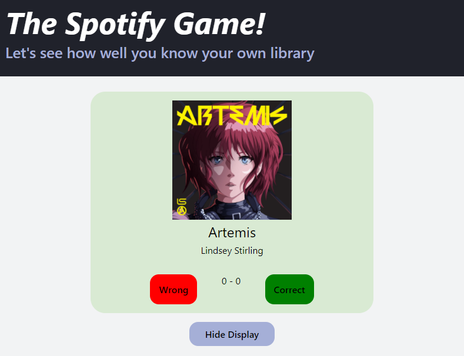

# The Spotify Game
This game is based on something I like to do when I am walking around while listening to music. I simply put a playlist on shuffle and then try to guess what artist or track is playing. I get a point if I get either right, lose one if I am wrong.

The problem with doing this manually is that I often forget the score. It'd be cool if something kept track of it for me.

That's where this could come in.

It's going to be interesting to see if I can construct or find a Spotify player that allows the user to select a playlist, or an artist, or use their currently playing spotify to do this. I think the first implementation will be mostly computer based so currently playing might not be a bad idea.

----
# Update on 2021-05-10

Using Spotify's Rest API, I was able to construct a crude example of what I'm thinking of doing.

There are issues with this current implementation

- The user has to have Spotify open on their computer, since it's not actually being played through the browser
- There is no way currently to progress to the next song. I'd need to make a PUT call, but that requires the user's token and I don't want to sloppily pass that around.

There could be a way to fix that. I found a node module that implements most of the functionality for Spotify. Might be worth using since then I can just import to the scoreboard and have control over the playback. Ideally what I am thinking is that the user will click "Right" or "Wrong" and the next track will load.